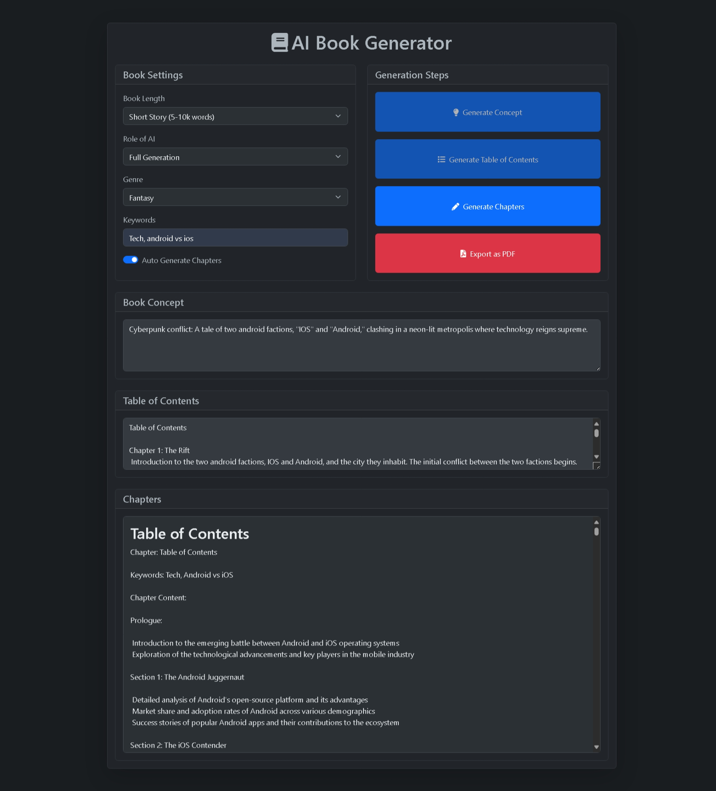

# AI-Book-Generator

AI-Book-Generator is a simple web application that uses the Gemini AI model to create unique, personalized books. Users can specify elements like characters and themes, and the AI generates a story based on these inputs.



## Features

- Generate stories with AI
- Customize content with genres and themes
- User-friendly interface built with HTML, CSS, and JavaScript

## Technologies Used

- **HTML, CSS, JavaScript** for the front-end
- **Gemini AI Model** for story generation

## Getting Started

1. **Clone the Repository**:
   ```bash
   git clone https://github.com/Shubhamgupta0309/AI-Book-Generator-using-Gemini.git
   cd AI-Book-Generator
   ```

2. **Add Gemini API Key**:
   - Replace your API in file named `apikey.js`.


3. **Run the Application**: Open `index.html` in a browser to start.

## Usage

1. **Enter Story Preferences**: Fill in genres, characters, and themes.
2. **Generate and Read**: Click "Generate" to create your book. You can read and customize as you go!

## License

This project is licensed under the MIT License.

## Contact

If you encounter any issues or have questions, feel free to reach out:

Email: shubham.gupta300904@gmail.com
